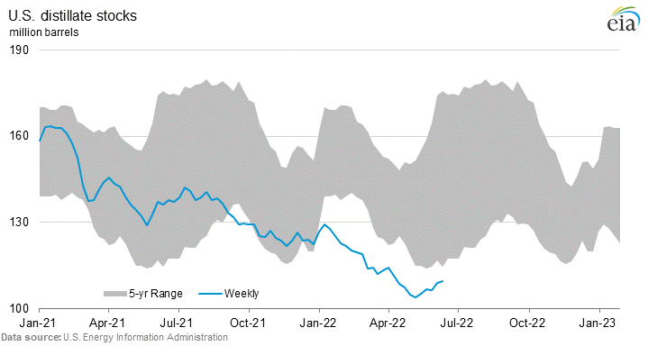

```{r setup, include=FALSE}
library(tidyverse)
library(scales)
library(patchwork)
library(ggthemes)
library(lubridate)
library(eia)
```
```{r load_data}
# this code expects that you have the EIA_KEY environment variable set


PANDEMIC_START <- "2019-03-01"
INVASION <- lubridate::date("2022-03-01")

operable_capacity <- eia_series("PET.MOCLEUS2.M")
gas_prices <- eia_series("PET.EMM_EPM0_PTE_NUS_DPG.M")

```

```{r transform_data}

operable_capacity <- operable_capacity[["data"]][[1]] %>%
  select(date, value) %>%
  rename(capacity = value)

gas_prices <- gas_prices[["data"]][[1]] %>%
  select(date, value) %>%
  rename(price = value)
  

combined_series <- left_join(gas_prices, operable_capacity) %>%
  filter(date >= PANDEMIC_START) %>%
  mutate(lost_capacity = replace_na(capacity - last(capacity), 0)) 
```

```{r line_chart}
p1 <- combined_series %>%
  ggplot(aes(x=date, y=price)) + 
  geom_line(color="#475ED1", alpha=0.75) + 
  geom_vline(xintercept=INVASION, color="#FB9851") + 
  theme_minimal() + 
  theme(
    axis.text.x=element_blank(),
    axis.ticks.x=element_blank()
  ) + 
  ylab("Price $/gal") + xlab("") + 
  scale_y_continuous(breaks=scales::pretty_breaks(n=10), labels=scales::dollar_format()) + 
  ggtitle("Gas Prices and Lost Refinery Capacity")
```

```{r bar_chart}

p2 <- combined_series %>%
  ggplot(aes(x=date, y=lost_capacity)) + 
  geom_bar(stat="identity", fill="#E2365B", alpha=0.5, na.rm=TRUE) + 
  geom_hline(yintercept=0, color="#E2365B") + 
  theme_minimal() + 
  theme(
    axis.text.x = element_text(angle=45)
  ) +
  ylab("Tousand barrels per day") + xlab("Month") + 
  scale_y_continuous(breaks=scales::pretty_breaks(n=5)) + 
  scale_x_date(date_labels="%b %y", breaks=scales::breaks_pretty(n=16))

```


Everybody is feeling the pain at the pump and much has been made about about the recent high gas prices.

The following two charts help explain why gas prices are so high and why they are probably not likely to come down any time soon. 

The data come from the [Energy Information Agency](https://www.eia.gov/) and are 
* average monthly retail price of gasoline, all grades
* [monthly refining capacity](https://www.eia.gov/dnav/pet/pet_pnp_unc_dcu_nus_m.htm)
* stocks of U.S. distillates (which include gasoline and diesel)

In the first chart, I have plotted the average monthly retail price of gasoline (all grades) from the Energy Information Administration along with refinery capacity lost since the start of the pandemic in March 2019. (note the capacity data ends in March since the EIA has not release data for later periods). 

During the pandemic, the U.S. lost about 800k barrels per day of refining capacity due to refinery closures as people stopped driving and demand for finished products fell. Refineries closed unprofitable operations with bleak long-term prospects and some were converted to [biofuel plants](https://www.reuters.com/business/energy/which-us-refineries-have-shut-since-global-pandemic-why-2022-06-17/). The increase in demand coming out of the pandemic created an imbalance in supply and demand that has resulted in today's high prices. 

I have also marked the start of Russia's invasion Ukraine to show that despite what some prominent politicians are saying, the price of gas was increasing well before "Putin's price hike" and that an imbalance between supply and demand are responsible for the current situation. 

The second chart comes directly from the EIA and shows that U.S. stocks of distillates, which include gasoline and diesel are at five year lows, contributing to the negative supply situation. 

These price rises are likely here to stay because building new refinery capacity takes years and tens of millions of dollars of investment with decades-long pay-off horizon. [The last major refinery](https://www.eia.gov/tools/faqs/faq.php?id=29&t=6) in the United States was build in 1977 and recently Chevron's CEO said [he believed it was unlikely](https://www.bnnbloomberg.ca/chevron-ceo-warns-not-to-count-on-new-us-oil-refinery-even-with-surging-gas-prices-1.1774203) that major new refineries would ever be build in this country again. 

```{r}
p1 + p2 + plot_layout(ncol=1, heights=c(2,1))
```




